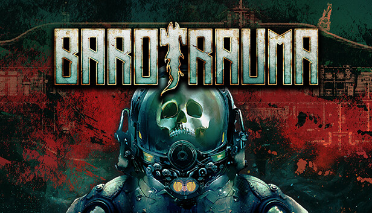

<h1 align="center">
    <a href=https://barotraumagame.com/>
        
    </a>
    Dockerized Barotrauma server
</h1>

<p align="center">Docker image that run Barotrauma dedicated server with auto update support</p>

<div align="center">
    <a href=https://github.com/super-bunny/barotrauma-server-docker/actions/workflows/docker_image.yml>
        
    </a>
</div>

# Usage

## Quick start

```bash
docker run \
  -it -d \
  --name barotrauma-server \
  -p 27015:27015/udp \
  --restart unless-stopped \
  ghcr.io/super-bunny/barotrauma-server:latest
```

:warning: The server will update on every container start.

If you want to access to configs and saves. You can mount volumes to `/config` and `/saves` respectively.

```bash
docker run \
  -it -d \
  --name barotrauma-server \
  -p 27015:27015/udp \
  -v ./config:/config \
  -v ./saves:/saves \
  --restart unless-stopped \
  ghcr.io/super-bunny/barotrauma-server:latest
```

## Docker compose

```yaml
version: "3"

services:
  server:
    image: ghcr.io/super-bunny/barotrauma-server:latest
    ports:
      - "27015:27015/udp"
    volumes:
      - ./config:/config
      - ./saves:/saves
    restart: unless-stopped
```

## Port forwarding

- `27015/udp`: Game server port.

## Volumes

- `/config`: Store server configs.
- `/saves`: Store server saves.
- `/barotrauma`: Barotrauma server root directory.